<center>
    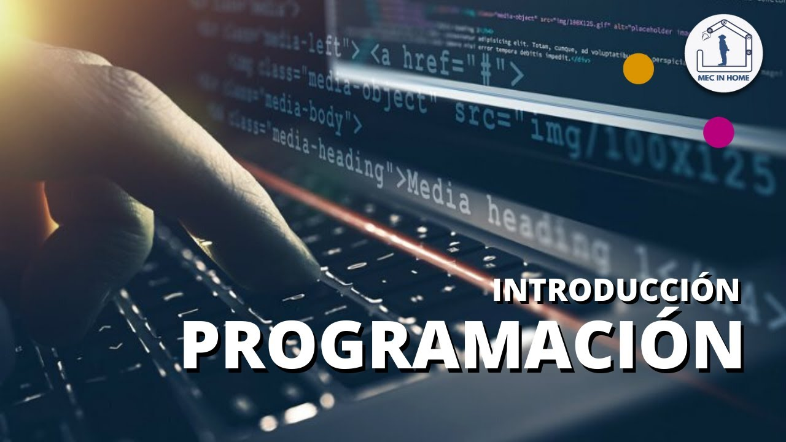
</center>

La mayoría de los dispositivos que utilizamos hoy en día, contienen un software o aplicación que le indica que funciones deben de realizar, las acciones que debe de hacer en cada cierto tiempo, o si el usuario presiona o selecciona un botón u opción.

Desde el software de una Smart Tv, consola de videojuegos, calculadoras científicas, automóviles autónomos, celulares, computadoras, servidores, hornos microondas, lavadoras, por nombrar algunos.

Es demasiado sencillo para el usuario operar este tipo de aplicaciones o dispositivos, pero que hay por detrás de esto.

La `programación` es la actividad mediante la cual las personas le indican a una computadora el procedimiento o conjunto de instrucciones para que, al ejecutarlas, ésta pueda resolver cierto problema  o necesidad deseadas.

La programación, aunque no lo parezca es un proceso creativo, es decir, en la mayoría de las ocasiones la tarea puede cumplirse siguiendo distintos caminos y el programador es el que debe imaginar cuáles son y elegir uno (el mejor). Algunos de estos caminos pueden ser mejores que otros, pero en cualquier caso la computadora se limitará a seguir las instrucciones ideadas por el programador (aunque en ocasiones estas instrucciones estén mal planeadas).

Desafortunadamente, las computadoras solo entienden ciertos lenguajes artificiales compuestos por una serie de expresiones; es por ello que a la hora de programar tenemos que ser `muy específicos`, es necesario `respetar las reglas de lenguaje de programación` y `ser claros en las indicaciones escritas`.

## Algoritmo

<center>
    
</center>

La programación consiste en escribir las indicaciones que debe de seguir un computador para completar una tarea, problema o necesidad, pero para poder escribir este tipo de indicaciones, el primer paso es pensar detalladamente cuál puede ser la forma de resolverlo, es decir, crear un `algoritmo`.

Un algoritmo es una estrategia consistente de un conjunto de pasos ordenados que nos lleva a la solución de un problema o alcance de un objetivo.

Un algoritmo debe de cumplir ciertos requisitos para que pueda ser correcto a prueba de fallas y errores, como se describen a continuación:

### 1. Robustez

Un algoritmo debe contemplar todas las posibles facetas del problema que queremos resolver. Al elaborar un algoritmo no se nos debe escapar ningún detalle que provoque un funcionamiento deficiente o malo en él. Si logramos construir un algoritmo robusto, cualquier giro inesperado del problema será controlado por el mismo, es decir, debe ser `flexible a cambios`.

### 2. Correctitud

Un algoritmo es correcto cuando da una solución al problema a tratar y cumple con todos los requerimientos especificos, de tal manera que logremos los objetivos planteados.

### 3. Completitud

Cuando un algoritmo cuenta con todos los recursos para poder llegar a una solución satisfactoria.

### 4. Eficiencia

Un algoritmo es eficiente cuando logra llegar a sus objetivos planteados utilizando la menor cantidad de recursos posibles, es decir, minimizando el uso de memoria, pasos y esfuerzo humano.

### 5. Eficacia

Un algoritmo es eficaz cuando alcanza el objetivo primordial, el análisis de resolución del problema lo realiza prioritariamente.

#### Diferencia entre eficiencia y eficacia

La eficacia difiere de la eficiencia en el sentido que la `eficiencia` hace referencia a la mejor utilización de los recursos, en tanto, la `eficacia` hace referencia en la capacidad para alcanzar un objetivo sin importar si se le ha dado el mejor uso posible a los recursos.

Para poder resolver un problema computacional debemos de realizar cuatro actividades hasta el momento:

* `Comprender el problema`: Este paso puede ser muy difícil, pero es definitivamente el más crucial. En este caso se plantea el problema de forma general, además se identifica los datos resultantes, es decir a lo que se quiere llegar; así como, los datos con los que se cuenta (datos de entrada). También es necesario verificar que la información dada sea suficiente para resolver el problema; y en caso de no tener la información necesaria (empezar a recolectarla).

* `Idear una solución`: Una vez que se ha comprendido el problema, se debe pensar en un plan de acción para resolverlo. Lo ideal sería visualizar o identificar diferentes soluciones que puedan llegar al mismo resultado, esto es para detectar si hubiera algún fallo o vulnerabilidad por algún camino, poderlo resolver con demasiada anticipación. Las técnicas más generales incluyen:

  * Buscar si existe problemas similares conocidos.
  * Relacionar el problema original de tal forma que se parezca a uno conocido.
  * Restringir el problema para resolverlo en una forma particular.
  * Generalizar un problema restringido.
  * Buscar trabajos existentes que puedan ayudar en la búsqueda de una solución.

* `Diseño del algoritmo`: Diseña o elige un algoritmo que ya exista para resolver el problema deseado (ojo, si vas a seleccionar un algoritmo ya hecho, asegúrate de que no tenga errores o trata de mejorarlo, añade un plus a esa creación).

* `Codificación`: Expresa el algoritmo en un lenguaje de programación para que el ordenador lo pueda interpretar y ejecutar.

Al aprender programación estamos destinados a enfrentarnos a problemas con diferentes grados de dificultad, mientras que la codificación se trata de aprender las múltiples reglas de cada uno de los lenguajes de programación.

### Diseño algorítmico

Cotidianamente, utilizamos los algoritmos para realizar casi todas las actividades diarias: preparar el desayuno, sacar a pasear la mascota, encender la tv y poner una película, etc. Cada una de estas tareas requiere llevar acciones de forma ordenada, aunque no hagamos un listado de las mismas y procedamos casi sin pensar.

Sin embargo, cuando pensamos en la solución de un problema que va a resolver una computadora, debemos ser claros y concretos, para asegurarnos de que los pasos del algoritmo lleguen a la solución y para que quien tenga que codificarlo, nosotros mismos u otras personas, lo pueda entender sin problemas.

Por eso, el primer paso es idear un algoritmo para su solución y expresarlo por escrito, por ejemplo, en español, pero adaptando el lenguaje humano a `formas lógicas` que se acerquen a las tareas que puede realizar una computadora.

En programación, el lenguaje artificial e informal que usan los desarrolladores en la confección de algoritmos recibe el nombre de `pseudocódigo`.

<center>
    
</center>

El `pseudocódigo` es una forma de expresar los distintos pasos que va a realizar un programa, de la forma más parecida a un lenguaje de programación.

El pseudocódigo no puede ejecutarse en un ordenador ya que entonces dejaría de ser pseudocódigo, como su propio nombre lo indica, se trata de un código falso *(pseudo = falso)*, es un código escrito para que lo entienda el ser humano y no la máquina.

Aprender a escribir pseudocódigo para la resolución de un problema permite hacer mucho más sencilla su programación en un lenguaje convencional, por lo que, si estás interesado en comenzar tu formación como programador y no tienes conocimientos previos, resulta muy recomendable y conveniente formarse en pseudocódigo antes de empezar a estudiar cualquier lenguaje de programación.

Podemos considerar al pseudocódigo como un `lenguaje intermedio`, que se encuentra en medio de nuestro propio lenguaje y el lenguaje de programación que entiende el ordenador.

### Principales características

Su principal característica es permitir a los desarrolladores `esbozar su código sin atascarse en la sintaxis` y la estructura de un lenguaje concreto. Esto facilita la detección de errores en la lógica de un programa o función, sin tener que escribir o depurar código real.

Es más, el pseudocódigo puede adaptarse fácilmente a distintos lenguajes de programación, lo que lo convierte en una herramienta útil para los desarrolladores que están familiarizados con varios lenguajes y necesitan trasladar sus ideas entre ellos. Esto puede ser especialmente útil para los equipos que trabajan juntos en un proyecto, ya que el pseudocódigo puede utilizarse como lenguaje común para comunicar ideas y funciones.

### Ventajas y desventajas

Las tareas más complejas o repetitivas pueden representarse de forma más sencilla ya que está escrito en un lenguaje sencillo y no estructurado que permite una transición sencilla al lenguaje de programación, más complejo y estructurado.

Tener un programa escrito en pseudocódigo facilita la tarea de programar en un lenguaje formal y mejora la calidad en la resolución de problemas, además de reducir el espacio necesario a la hora de desarrollar un problema.

El pseudocódigo llega donde el diagrama de flujo no lo hace. La solución de un diagrama de flujo suele ser la ideal, pero no suele ser fácil de implementar al crear el programa. El pseudocódigo permite que el diseño del programa y su implementación sean muy parecidos.

La curva de aprendizaje del pseudocódigo es baja por lo que facilitan enormemente el aprendizaje de la programación y la iniciación a lenguajes de programación más avanzados y complejos.

El pseudocódigo, al ser independiente del lenguaje de programación, permite que su uso se pueda aplicar utilizando diferentes lenguajes y permitiendo que el programador no tenga que ser la misma persona que escriba el pseudocódigo.

Al no ser ejecutable, tu pseudocódigo no necesitará alojarse online ni conectarse a ningún `script` externo como haría una aplicación completa. Puede crearse y guardarse en un archivo en tu máquina local, en un archivo en la nube, o incluso copiarse en un correo electrónico.

Una de las desventajas del uso de pseudocódigo es el caso de problemas muy extensos, puede llegar a ser difícil de entender.

### Componentes y sintaxis

Para escribir programas utilizando pseudocódigo es necesario seguir unas pautas o normas de sintaxis para que puedan ser leídos y comprendidos por los programadores a la hora de pasarlos a un lenguaje de programación.

#### Pasos para escribir

Aquí hay algunos pasos generales que puedes seguir para escribir un buen pseudocódigo:

1. `Abre tu editor de texto`: La mayoría de las veces, el pseudocódigo se escribe en un editor de texto o HTML. Puedes elegir tu favorito y abrir un nuevo archivo.

2. `Define tu objetivo`: Determina la finalidad de tu programa o función. *¿Qué quieres que haga?*

3. `Sepáralo en partes`: Divide el problema en trozos más pequeños y manejables. Esto puede ayudarte a pensar en el problema con más claridad y facilitar la organización de las piezas para que funcionen donde y cuando deban.

4. `Organízalo en pasos`: Escribe los pasos de tu programa en orden lógico. Utiliza un lenguaje natural y evita utilizar construcciones o métodos de programación específicos, como estructuras de control o conversión de tipos.

5. `Sangría en las líneas`: Utiliza la sangría para mostrar la estructura de tu código. Por ejemplo, puedes sangrar las líneas de código que pertenecen a un bucle.

6. `Pruébalo`: Prueba tu pseudocódigo para asegurarte de que es claro y lógico. Puedes hacerlo recorriéndolo verbalmente o pidiendo a otra persona que lo lea y te informe de lo que cree que debe hacer el pseudocódigo.

Una vez escrito el pseudocódigo, tendrás que convertirlo en un `script ejecutable`. Puedes practicar esto fuera de tus proyectos contribuyendo a repositorios Git de código abierto, aceptando retos de código y haciendo/respondiendo preguntas en [StackOverflow](https://stackoverflow.com/) o dentro de tu comunidad de desarrollo.

### Construcciones de pseudocódigo

Existen varias construcciones de programación comunes que los desarrolladores suelen utilizar al escribir pseudocódigo. Veamos cada una de ellas.

#### Secuencias

Una secuencia es un grupo de sentencias que se ejecutan en un orden concreto. Se utilizan para realizar o repetir una serie de acciones sencillas. Algunos comandos de secuencia conocidos y utilizados habitualmente en pseudocódigo son:

* INPUT (Entrada)
* SET (Colocar)
* PRINT (Imprimir)
* READ (Leer)
* DISPLAY (Mostrar)
* SHOW (Mostrar)
* CALCULATE (Calcular)

#### Condicionales

Las sentencias condicionales permiten que un programa tome decisiones basándose en determinadas condiciones, y luego dirigen el programa para que ejecute determinadas sentencias si se cumple (o no) una condición.

* IF-ELSE (si-entonces)
* IF-IF ()
* ELSE-ELSE ()
* CASE ()

#### Iteraciones

Las sentencias de iteración repiten un conjunto de pasos dentro de una función o proceso más amplio. A menudo se utilizan para realizar la misma operación en varios elementos de una lista o para repetir un proceso hasta que se cumplan determinadas condiciones.

Las iteraciones son útiles para repetir un conjunto de pasos varias veces y pueden implementarse utilizando varios tipos de bucles:

* FOR (Para)
* WHILE (Mientras)
* DO-WHILE (Hacer mientras)

### Buenas Prácticas de Pseudocódigo

Aquí tienes unas cuantas pautas generales que pueden ayudarte a escribir pseudocódigo claro y eficaz en cada ocasión:

1. `Utiliza un lenguaje natural`: El pseudocódigo debe escribirse de forma que sea fácil de entender para cualquiera, utilizando lenguaje natural en lugar de jerga técnica.
2. `Hazlo sencillo`: Evita utilizar lenguaje o sintaxis complejos, y céntrate en expresar los pasos del algoritmo o proceso de forma clara y concisa.
3. `Sé específico`: Sé lo más específico posible al escribir el pseudocódigo, incluyendo información como nombres de variables y valores concretos.
4. `Omite los detalles innecesarios`: Si te preocupas por la convención de mayúsculas y minúsculas que debes adoptar o por si debes usar punto y coma, estás dándole demasiadas vueltas. Haz que tu texto en pseudocódigo sea lo más sencillo y directo posible.
5. `Utiliza elementos similares a los de programación`: Aunque el pseudocódigo no debe escribirse en un lenguaje de programación específico, puede ser útil utilizar elementos como bucles, sentencias condicionales y llamadas a funciones para facilitar a los lectores la comprensión de los pasos de tu programa.
6. `Utiliza la sangría para mostrar la jerarquía`: La sangría puede utilizarse para mostrar la jerarquía de los pasos de tu programa, facilitando la comprensión de la lógica y la estructura.

Siguiendo estas pautas, puedes escribir un pseudocódigo claro y eficaz que tú y otros puedan utilizar como guía para implementar una función o algoritmo en un `lenguaje de scripting` o programación específico.

### Estructura de un programa escrito con pseudocódigo

Ahora vamos a conocer la estructura formal de un programa escrito con pseudocódigo. Como todo programa informático, necesita una estructura determinada para su realización:

Cabecera:

* Programa
* Modulo
* Tipos de datos
* Constantes
* Variables

Cuerpo:

* Inicio
* Instrucciones
* Fin

`Nota`: Si queremos hacer un comentario dentro del pseudocódigo, iniciamos la línea del comentario con dos asteriscos (**).

Un desarrollo de software escrito en pseudocódigo debe permitir la ejecución de instrucciones

* Primitivas
* De proceso
* De control
* De descripción
* Compuestas

Para ello, en la redacción de pseudocódigo, los usuarios tienen disponibles tres tipos de estructuras básicas de control:

* Las secuenciales
* Las selectivas
* Las iterativas

A continuación, se describe cada una de ellas de forma más detallada:

* `Estructuras secuenciales`. Las instrucciones se siguen en una secuencia fija que normalmente se encuentra definida por el número de renglón. Esto significa que las instrucciones se ejecutan de arriba hacia abajo.

* `Estructuras selectivas`. Las instrucciones selectivas representan instrucciones que pueden o no ejecutarse, de acuerdo el cumplimiento de una condición.

* `Selectiva doble (alternativa)`. La instrucción alternativa realiza una instrucción de dos posibles, de acuerdo al cumplimiento de una condición.

* `Selectiva múltiple`. Otro uso común es también la utilización de una selección múltiple, lo que equivaldría a anidar varias funciones de selección. En este tipo de situaciones, existen una serie de condiciones que tienen que ser mutuamente excluyentes, si una de ellas se cumple las demás tienen que ser necesariamente falsas, hay un caso *“Si no”* que será verdadero cuando las demás condiciones sean falsas.

* `Selectiva múltiple-Casos`. Este caso es similar al anterior. Aquí nos encontramos con un *“Indicador”* que es una variable o una función cuyo valor es comparado en cada caso con los valores *(Valor)*. En el caso que coincidan ambos valores, entonces se ejecutarán las *(Instrucciones)* correspondientes.

* `Estructuras iterativas`. La estructura iterativa o de repetición permite ejecutar una o varias instrucciones un número determinado de veces o de forma indefinida mientras se cumpla una determinada condición.

* `Bucle mientras`. En este caso, el objetivo principal del bucle es repetir un bloque de código mientras una condición se mantenga verdadera.

* `Bucle repetir`. El bucle repetir comprueba que las instrucciones del cuerpo del bucle hayan llegado a su final, entonces si es verdadera continua con la ejecución del resto del programa.

* `Bucle hacer`. El Bucle es utilizado para repetir un bloque de código de un programa mientras se cumpla cierta condición.

* `Bucle para`. Este bucle es utilizado cuando se desea iterar un número conocido de veces, empleando como índice una variable que aumenta o disminuye.

* `Bucle para cada`. Esta sentencia, de uso muy extendido, es utilizada cuando se tiene una lista o un conjunto.

* `El anidamiento`. El anidamiento permite incorporar llamadas a funciones o procedimientos dentro de otros procedimientos, gracias a la inclusión de diversos niveles de paréntesis. Esto significa que cualquier instrucción puede ser sustituida por una estructura de control.

El pseudocódigo, como cualquier otro lenguaje, está compuesto por:

* `Léxico`: conjunto de palabras o frases válidas para escribir las instrucciones.
* `Sintaxis`: reglas que establecen cómo se pueden combinar las distintas partes.
* `Semántica`: significado que se les da a las palabras o frases.

El pseudocódigo sigue una *estructura secuencial* (define una acción o instrucción que sigue a otra en secuencia). Esta estructura puede representarse de la siguiente forma:

```text
ALGORITMO: "Ejemplo"
COMENZAR
    Acción 1
      Si se cumple
        Acción 1.1
      Si no
        Acción 1.2
    Acción 2
    ...
    Acción N
FIN
```

Se comienza con un título que describa el problema que el algoritmo resuelve, seguido por la palabra *COMENZAR*. Luego se detallan las acciones o instrucciones a seguir y se concluye con la palabra *FIN*.

Es importante destacar la presencia de sangrías (sangrado) como en el ejemplo anterior, que facilitan la lectura. Los algoritmos suelen ser representados también mediante *diagramas de flujo*.

## Diagrama de flujo

<center>
    
</center>

Un Diagrama de Flujo representa la esquematización gráfica de un algoritmo, el cual muestra gráficamente los pasos o procesos a seguir para alcanzar la solución de un problema. Su correcta construcción es sumamente importante porque, a partir del mismo se escribe un programa en algún Lenguaje de Programación. Si el Diagrama de Flujo está completo y correcto, el paso del mismo a un Lenguaje de Programación es relativamente simple y directo.

Es importante resaltar que el Diagrama de Flujo muestra el sistema como una red de procesos funcionales conectados entre sí por *"Tuberías"* y *"Depósitos"* de datos que permite describir el movimiento de los datos a través del Sistema.

Este describirá:

* Lugares de Origen y Destino de los datos
* Transformaciones a las que son sometidos los datos
* Lugares en los que se almacenan los datos dentro del sistema
* Los canales por donde circulan los datos.

Se basan en la utilización de diversos símbolos para representar operaciones específicas, es decir, es la representación grafica de las distintas operaciones que se tienen que realizar para resolver un problema, con indicación expresa el orden lógico en que deben realizarse.

Se les llama diagramas de flujo porque los símbolos utilizados se conectan por medio de flechas para indicar la secuencia de operación. Para hacer comprensibles los diagramas a todas las personas, los símbolos se someten a una normalización; es decir, se hicieron símbolos casi universales, ya que, en un principio cada usuario podría tener sus propios símbolos para representar sus procesos en forma de Diagrama de flujo.

Esto trajo como consecuencia que sólo aquel que conocía sus símbolos, los podía interpretar. La simbología utilizada para la elaboración de diagramas de flujo es variable y debe ajustarse a un patrón definido previamente.

El diagrama de flujo representa la forma más tradicional y duradera para especificar los detalles algorítmicos de un proceso. Se utiliza principalmente en programación, economía y procesos industriales.

### Importancia

Los diagramas de flujo son importantes porque nos facilita la manera de representar visualmente el flujo de datos por medio de un sistema de tratamiento de información, en este realizamos un análisis de los procesos o procedimientos que requerimos para realizar un programa o un objetivo.

### ¿Cuál es el procedimiento del diagrama de flujo?

El diagrama de flujo puede hacerse de manera manual en una pizarra o mediante el ordenador. El procedimiento básico es el siguiente:

1. Primero que nada, define el proceso a diagramar. Escribe en la parte superior del diagrama el título de lo que se va a analizar.
2. Analiza, discute y decide los límites que tendrá el proceso. Cuando, cómo o dónde se va a llevar a cabo. Principio y fin.
3. Anota las actividades y tareas que se llevarán a cabo.
4. Organiza en secuencia todas las actividades anteriormente anotadas.
5. Entre todos los trabajadores, se deberá estar de acuerdo con la secuencia de todas las actividades, de que están correctas. Luego empieza a dibujar las flechas para organizar el orden.
6. Finalmente, puedes analizar y discutir el diagrama de flujo con otros trabajadores involucrados en el proceso, pueden ser clientes, supervisores, etc. Esto es para tener en mente de que si están de acuerdo a que todo está hecho con precisión.

### Método de ordenación por burbuja

El método de ordenación por burbuja es un algoritmo de ordenamiento, que funciona revisando cada elemento de la lista que va a ser ordenada con el siguiente, e intercambiándolos de posición si esta está en el orden erróneo. Es estrictamente necesario realizar este proceso varias veces de modo que no necesite mas intercambios, hasta que este ordenada. En este método de ordenación se realiza el intercambio entre los más grandes y los mas pequeños (los más grandes quedan arriba y los pequeños abajo).

Estos intercambios suceden en dos ciclos un ciclo que es interno que realiza las comparaciones y
se asegura de que en la primera revisión que los elementos mas grandes suban a la posición
más alta, y el otro ciclo que es un poco mas externo se encarga de realizar las revisiones.

### Elementos

Principalmente, un diagrama de flujos está formado por diferentes elementos que nos permiten dar forma a la idea del algoritmo:

* `Línea o flechas del flujo`: Indica la instrucción que se va a realizar, o la dirección del flujo del proceso.

<center>
    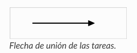
</center>

* `Conectores de flechas del flujo`: Cuando las dos tareas a unir están demasiado lejos o cuando resulta confuso cruzar muchas flechas, entonces se utilizan dos círculos con un mismo número, para indicar el comienzo y el final de la flecha:

Cada flecha debe tener un número diferente, de forma que debe haber solo 2 círculos con un mismo número: un círculo de comienzo y otro de finalización.

<center>
    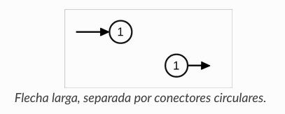
</center>

* `Inicio y final`: Es la forma en la cual se indica el “inicio del proceso” y “final del proceso”. Su icono suele ser un rectángulo con las esquinas redondeadas.

<center>
    
</center>

* `Asignación/ definición`: Permite asignar un valor o definir una variable, son los procesos o actividades que se necesitan para resolver el problema. En este caso, suele estar representado con un rectángulo.

<center>
    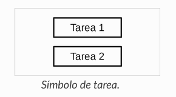
</center>

* `Datos de entrada o de salida`: Representa la impresión de datos en la salida. Se representa con un recuadro con las esquinas inclinadas y una flecha hacia fuera.

<center>
    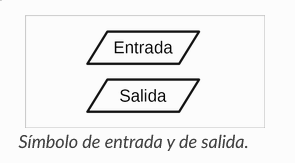
</center>

* `Decisión`: Indica que del punto en donde nos encontramos, puede haber más de un camino para seguir, según la condición dada. En este caso se usa un rombo.

<center>
    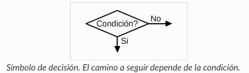
</center>

En seguida se mostrarán los simbolos que se pueden llegar a utilizar al momento de elaborar un diagrama de flujo.

<center>
    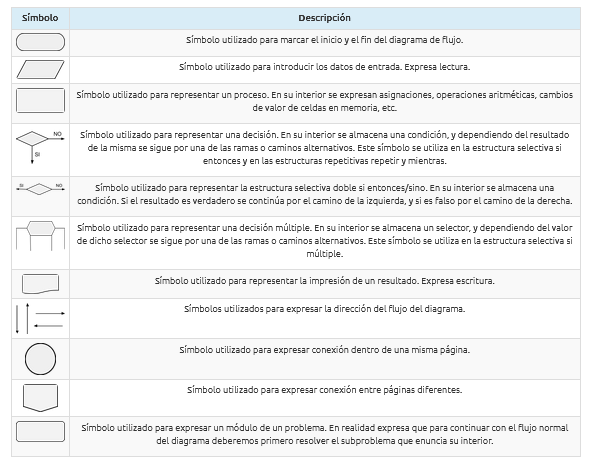
</center>

### Estructuras de Diagramas de Flujo

### Estructura Condicional

 Las estructuras lógicas selectivas se encuentran en la solución algorítmica de casi todo tipo de problemas. Las utilizamos cuando en el desarrollo de la solución de un problema debemos tomar una decisión, para establecer un proceso o señalar un camino alternativo a seguir.

Esta toma de decisión se basa en la evaluación de una o más condiciones que nos señalarán como alternativa o consecuencia, la rama a seguir.

Hay situaciones en las que la toma de decisiones se realiza en cascada. Es decir, se toma una decisión, se marca la rama correspondiente a seguir, se vuelve a tomar otra decisión y así sucesivamente. Por lo que para alcanzar la solución de un problema o subproblema debemos aplicar prácticamente un árbol de decisión.

La estructura permite que el flujo del diagrama siga un camino específico si se cumple una condición o un conjunto de condiciones. Si al evaluar la condición el resultado es verdadero se ejecuta(n) cierta(s) operación(es). Esta estructura se dice que es binaria dado que solo tiene dos posibles respuestas: si o no.

<center>
    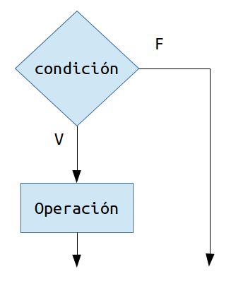
</center>

### Estructura Condicional Múltiple

La estructura selectiva permite que el flujo del diagrama se bifurque por varias ramas en el punto de la toma de decisión(es), esto en función del valor que tome el selector.

El selector múltiple, a diferencia del selector simple, no es binario sino que tiene 3 o más posibles ramas para la decisión.

Este tipo de selector permite elegir entre un número determinado de posibilidades, un número discreto (finito) de ellas. Por esta razón es que si se necesita evaluar un conjunto contínuo (infinito) de posibles valores, este tipo de selector no es apropiado para ello.

<center>
    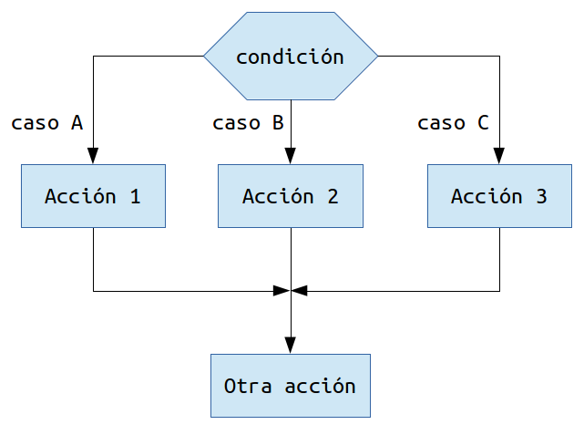
</center>

### Estructuras Algorítmicas Repetitivas

En la construcción de algoritmos para resolver un problema específico es muy común encontrarse con la necesidad de repetir alguna operación para la realización de esa tarea. En dicha repetición, que a partir de ahora llamaremos `iteración`, puede ser necesario resolver alguna(s) operación(es) aritmética(s) o la evaluación de alguna decisión. En cualquier caso se necesitan de las estructuras algorítmicas repetitivas.

Todo ciclo debe terminar de ejcutarse luego de un número finito de iteraciones, por lo que es necesario verificar la(s) condición(es) en cada iteración para determinar si se debe continuar la ejecución o detenerse.

De esta forma todos los ciclos tienen estos tres elementos:

* `Condición Inicial`: Es el punto de partida del ciclo, debe ser una condición verdadera para que el ciclo pueda iniciar.
* `Condición Final`: Establece el punto final del ciclo, una vez que se cumpla la condición el ciclo deberá terminar.
* `Incremento`/`Decremento`/`Cambio`: Es el cambio de las variables que controlan el ciclo. El cambio puede ser un incremento, decremento o alguna otra condición.

### Estructura Repetitiva repetir

La estructura repetir conocida comúnmente como `for`, es la estructura algorítmica cuya característica principal es que se sabe de antemano el número de iteraciones que ocurrirán. Este tipo de estrcutura está presente en todos los lenguajes de programación.

El diagrama de flujo de la estructura repetir es el siguiente:

<center>
    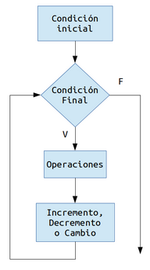
</center>

 Para utilizar este ciclo se debe establecer un punto de partida, un fin y como se progresará desde el inicio al final; es decir, una condición incial, una condición final y un cambio. Como se sabe toda esta información de antemano, por lo tanto se sabe el número de iteraciones que realizará el ciclo. El control de las iteraciónes lo realiza una `variable de control`.

Para comenzar el ciclo, la variable de control toma el valor establecido en la condición inicial y se evalúa contra la condición final, y si el resultado de dicha evaluación es verdadero se realiza una iteración del ciclo. Dentro del ciclo hay una o muchas operaciones que se pueden llevar a cabo, y al final de todas ellas debe ocurrir un incremento, decremento o un cambio en la variable que controla el ciclo.

Por ejemplo, considere que existe una operación `X` que necesita ser realizada 10 veces. Debemos definir la variable de control del ciclo, digamos `i`. Dicha variable i deberá contar el número de iteraciones, es decir, deberá comenzar con un valor de 1 y terminará cuando valga 10. Por lo tanto, la condición inicial es i=1, la condición final i=10 y el cambio de la variable es un incremento en 1.

El diagrama de flujo correspondiente es el siguiente:

<center>
    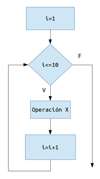
</center>

Observe que la condición final se estableció como `i<=10` siendo quizás la manera más obvia i!=10, para entender el porque considere lo siguiente. Dado que la variable i comienza en 1 y el incremento también es en 1, todos los valores que tomará la variable i dentro del ciclo son menores o iguales que 10, razón por la cual se establece de esa forma.

Considere además que si pusieramos como condición `i!=10` el ciclo funcionaría de manera idéntica para este ejemplo, pero si por alguna razón en algún momento de la ejecución del ciclo la variable i tomara un valor distinto a los esperados, no tendríamos forma de saberlo y esto ocasionaría que el ciclo se comportara de maneras inesperadas.

Este tipo de situaciones son comunes sobre todo cuando los algoritmos son más complejos y existen más operaciones dentro del ciclo. Por esta razón es más conveniente optar por esta convención ya que nos evitará problemas en el futuro.

### Estructura Repetitiva Mientras

La estructura `mientras` conocida comúnmente como `while`, es la estructura algorímtica cuya característica principal es que no se sabe de antemano el número de iteraciones que ocurrirán. Esta estructura también se encuentra presente en todos los lenguajes de programación.

El diagrama de flujo de la estructura mientras es el siguiente:

<center>
    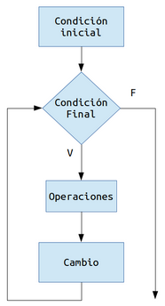
</center>

Para utilizar este ciclo se debe establecer un punto de partida y un final; es decir, una condición incial y una condición final. El control de las iteraciónes lo realiza una variable de control. Para comenzar el ciclo la variable de control toma el valor de la condición inicial y en cada iteración se evalúa esta variable de control contra la condición final. El ciclo realizará iteraciones mientras tal evaluación sea verdadera.

A diferencia de repetir, en el ciclo mientras no se sabe necesariamente con exactitud como cambia la variable de control, lo que si se debe saber con precisión es donde comienza el ciclo y donde termina. Por lo tanto, como no se sabe toda esa información, tampoco se sabe el número de iteraciones que realizará el ciclo.

## Codificación

<center>
    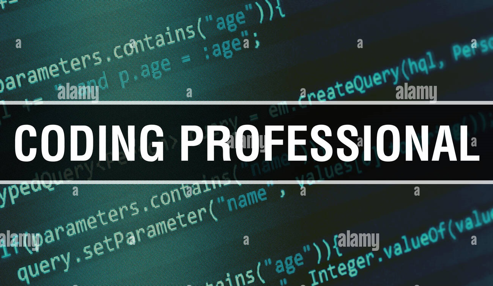
</center>

Si bien hay distintos lenguajes de programación; una computadora en definitiva es un aparato que sólo sabe hablar en `binario`, es decir, sólo interpreta señales eléctricas con dos estados posibles, los cuales son representados por los `dígitos binarios (0, 1)`. Este sistema de código con ceros y unos que la computadora interpreta como instrucciones o conjuntos de datos se llama lenguaje de máquina *(código de máquina)*.

A principios de la década de 1950 se inventaron los *lenguajes ensambladores*, que usan palabras para representar simbólicamente las operaciones que debe realizar la computadora. Cada una de estas palabras reemplaza un código de máquina binario, siendo un poco más fácil de programar.

En programación, la idea de simplificar un proceso complejo ignorando algunas de sus partes para comprender mejor lo que hay que realizar y así resolver un problema se conoce como `abstracción`. Los lenguajes de programación pueden tener distintos niveles de abstracción:

* `Lenguajes de bajo nivel`: permiten controlar directamente el hardware de la computadora, son específicos para cada tipo de máquina, y son más rígidos y complicados de entender para nosotros. El *lenguaje ensamblador* entra en esta categoría.

* `Lenguajes de alto nivel`: diseñados para que sea fácil para los humanos expresar los algoritmos sin necesidad de entender en detalle cómo hace exactamente el hardware para ejecutarlos.

* `Lenguajes de nivel medio`: son lenguajes con características mixtas entre ambos grupos anteriores.

Si bien podemos programar usando un lenguaje de alto nivel para que nos resulte más sencillo, alguien o algo debe traducirlo a lenguaje de máquina para que la computadora, que sólo entiende de ceros y unos, pueda realizar las tareas. Para estos procesos de traducción se crearon los `compiladores` e `intérpretes`.

Un `compilador` es un programa que toma el código escrito en un lenguaje de alto nivel y lo traduce a código de máquina, guardándolo en un archivo que la computadora ejecutará posteriormente (archivo ejecutable ".exe").

Para ilustrar el rol del compilador, imaginemos que alguien que sólo habla español le quiere mandar una carta escrita en español a alguien que vive en Alemania y sólo habla alemán. Cuando esta persona la reciba, no la va a entender. Se necesita de un intermediario que tome la carta en español, la traduzca y la escriba en alemán y luego se la mande al destinatario, quien ahora sí la podrá entender. Ese es el rol de un compilador en la computadora.

Ahora bien, el resultado de la traducción, que es la carta escrita en alemán, sólo sirve para gente que hable alemán. Si se quiere enviar el mismo mensaje a personas que hablen otros idiomas, necesitaremos hacer la traducción que corresponda. De la misma forma, el código generado por un compilador es específico para cada máquina, depende de su arquitectura.

Un `intérprete` es un programa que traduce el código escrito en lenguaje de alto nivel a código de máquina, pero lo va haciendo a medida que se necesita, es decir, su resultado reside en la memoria temporal de la computadora y no se genera ningún archivo ejecutable.

Siguiendo con el ejemplo anterior, es similar a viajar a Alemania con un intérprete que nos vaya traduciendo en vivo y en directo cada vez que le queramos decir algo a alguien de ese país.

Concluyendo, gracias al concepto de la abstracción podemos escribir programas en un lenguaje que nos resulte fácil entender, y gracias al trabajo de los compiladores e intérpretes la computadora podrá llevar a cabo las tareas necesarias.

Cada una de las acciones que componen al algoritmo son codificadas con una o varias instrucciones, expresadas en el lenguaje de programación elegido, y el conjunto de todas ellas constituye un programa.

### Errores de programación

Apenas iniciemos nuestro camino en el mundo de la programación nos daremos cuenta que tendremos siempre ciertos compañeros de viaje: `los errores`. Muchas veces nos pasará que queremos ejecutar nuestro código y el mismo no se ejecuta o no se obtiene el resultado esperado.

No importa lo cuidadosos que seamos, ni cuánta experiencia tengamos, los errores están siempre presentes. Con el tiempo y práctica, vamos a poder identificarlos y corregirlos con mayor facilidad, pero probablemente nunca dejemos de cometerlos.

A los errores en programación se los suele llamar `bugs` (insecto en inglés) y el proceso de la corrección de los mismos se conoce como `debugging` (depuración).

A continuación, se presenta una de las posibles clasificaciones de los errores que se pueden cometer en programación:

* `Errores de sintaxis`. Tal como el lenguaje humano, los lenguajes de programación tienen su propio vocabulario y su propia sintaxis, se trata del conjunto de reglas gramaticales que establecen cómo se pueden combinar las distintas partes.

Estas reglas sintácticas determinan que ciertas instrucciones están correctamente construidas, mientras que otras no. Cuando ejecutamos un programa, el compilador o el intérprete chequea si el mismo es sintácticamente correcto.

Si hemos violado alguna regla, por ejemplo, nos faltó una coma o nos sobra un paréntesis, mostrará un mensaje de error y debemos editar nuestro programa para corregirlo. En estos casos, hay que interpretar el mensaje de error, revisar el código y corregir el error.

* `Errores lógicos`. Se presentan cuando el programa puede ser compilado sin errores, pero arroja resultados incorrectos o ningún resultado.

El software no muestra mensajes de error, debido a que, por supuesto, no sabe cuál es el resultado deseado, sino que sólo se limita a hacer lo que hemos programado.

En estos casos hay que revisar el programa para encontrar algún error en su lógica. *Este tipo de errores suelen ser los más problemáticos*.

Algunas ideas para enfrentarlos incluyen volver a pensar paso por paso lo que se debería hacer para solucionar el problema y compararlo con lo que se ha programado, agregar pasos para mostrar resultados intermedios o emplear herramientas especializadas de debugging (*debugger*) para explorar el código paso a paso hasta identificar el error.

* `Errores en la ejecución`. Se presentan cuando el programa está bien escrito, sin errores lógicos ni sintácticos, pero igualmente se comporta de alguna forma incorrecta.

Se dan a pesar de que el programa ande bien en el entorno de desarrollo del programador, pero no cuando algún usuario lo utiliza en algún contexto particular. Puede ser que se intente abrir un archivo que no existe, que el proceso supere la memoria disponible, que tomen lugar operaciones aritméticas no definidas como la división por cero, etc.

Los errores en la programación son tan comunes, que un científico de la computación muy reconocido, Edsger Dijkstra, dijo una vez: `“si la depuración es el proceso de eliminar errores, entonces la programación es el proceso de generarlos”.` Ante la presencia de uno, no hay más que respirar profundo y con paciencia revisar hasta encontrarlo y solucionarlo.

## Lógica de programación

<center>
    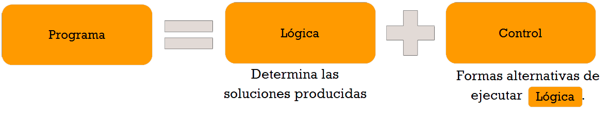
</center>

Es importante tener en cuenta que practicar y aprender de los errores son aspectos esenciales para aprender sobre lógica de programación, y una cierta afinidad con las **matemáticas** y el **inglés** ayudarán bastente en la lógica y comprensión de los lenguajes de programación.

El estudio de la programación está conectado directamente al área de las *ciencias exactas*; y las matemáticas, con sus reglas, estarán presente en diversos momentos. Por otro lado el inglés, es fundamental en cualquier profesión, también será importante, ya que al programar encontrarás una mayor variedad de cursos y materiales en este idioma. Y además, la mayoría de los lenguajes de programación utilizan el inglés como base.

La lógica es la base de todo el conocimiento en programación, ya que es posible aprender a escribir un código para que la computadora interprete correctamente. Es decir que aprendes a comunicarte con la máquina a partir de un lenguaje.

El gran desafío del programador es entonces montar la estructura del programa para que este sea ejecutado por la computadora. Y es necesario partir del principio de que la computadora no piensa de la misma forma que el ser humano, y no es inteligente para saber qué es lo que tiene que hacer, ni comprender mensajes subjetivos.

Por eso organizar la información de forma clara y en el orden adecuado es primordial para que la acción sea ejecutada correctamente.

## Variables y Constantes

Seguramente ya has escuchado hablar sobre variables y constantes cuando se trata de programación, ¿no es verdad? Son valores que componen cálculos o condiciones y están presentes en todas las partes del programa.

Una *variable* es un espacio para almacenar un tipo de dato que puede ser modificado cuando sea necesario.

En cambio la *constante* posee un dato definido al inicio del programa y no podrá ser alterado.

## Programa

Un programa puede ser cualquier cosa que se escriba con código. Algunos ejemplos de programas que se ejecutan en distintos dispositivos son:

* Websites
* Juegos
* Aplicaciones de teléfono

Aunque es posible crear un programa sin escribir código, el dispositivo interpreta la lógica subyacente, que es muy probable que se haya escrito con código. Un programa en ejecución o que ejecuta código está llevando a cabo instrucciones.

## Lenguajes de Programación

Los lenguajes de programación se presentan en diferentes formatos y pueden servir para distintos propósitos. Por ejemplo, *JavaScript* se usa principalmente para aplicaciones web, y *Bash* se usa principalmente para sistemas operativos.

### Elementos de un programa

Saber cómo se ejecuta un programa y en qué datos se basa es un primer paso importante para saber cómo crear sus propios programas.

Una única indicación de un programa se denomina instrucción. Normalmente, una instrucción tiene un espaciado entre caracteres o un interlineado que marcan dónde termina o finaliza la instrucción. La forma en que un programa finaliza varía según cada lenguaje.

### Los programas están basados en datos

La mayoría de los programas se basan en el uso de los datos obtenidos de un usuario u otro origen, donde las instrucciones pueden basarse en estos datos para llevar a cabo instrucciones. Los datos pueden cambiar el comportamiento de un programa, por lo que los lenguajes de programación ofrecen una forma de almacenar temporalmente los datos para su uso posterior.

Los datos se almacenan en una instrucción denominada *variable*. Las variables son instrucciones que indican a un dispositivo que guarde los datos en su memoria. Las variables de los programas son similares a las de álgebra, donde tienen un nombre único y su valor puede cambiar con el tiempo.

### Control de flujo

Es posible que un dispositivo no ejecute algunas instrucciones. Esto suele ocurrir por diseño, según lo que escriba el desarrollador, o por accidente, a raíz de un error inesperado.

Controlar el flujo de una aplicación hace que sea más sólida y fácil de mantener. Los cambios en el control suelen producirse cuando se cumplen determinadas condiciones. 

Una instrucción común de los lenguajes de programación modernos, para controlar cómo se ejecuta un programa, es (if, else).

## Herramientas profesionales

La capacidad de desarrollar código rápidamente es fundamental. Tener una herramienta para ello no solo aporta velocidad, sino que también suele ayudarle con el formato y la exactitud.

Un entorno de desarrollo es un conjunto único de herramientas y características que un desarrollador puede usar para escribir software. Algunas de estas herramientas se han personalizado para satisfacer las necesidades específicas del desarrollador. Pueden cambiar con el tiempo a medida que los desarrolladores cambian las prioridades en proyectos profesionales o personales, o cuando cambian a un lenguaje de programación diferente. Los entornos de desarrollo son tan particulares como los desarrolladores que los usan.

### Editores

Una de las herramientas más cruciales para el desarrollo de software es el entorno de edición. Un editor es donde se escribe el código y, a veces, donde se ejecuta.

Los desarrolladores confían en los editores para sus características útiles, entre las que se incluyen:

* **Depuración**: ayuda a detectar errores mediante la ejecución del código paso a paso, línea por línea. Algunos editores tienen funcionalidades de depuración o se pueden personalizar para lenguajes de programación específicos.

* **Resaltado de sintaxis**: agrega colores y formato de texto al código, lo que facilita la lectura. La mayoría de los editores permiten el resaltado de sintaxis personalizado.

* **Extensiones e integraciones**: agregue características especializadas que proporcionen acceso a otras herramientas que no están integradas en el editor base. Por ejemplo, muchos desarrolladores también necesitan una manera de documentar su código, explicar cómo funciona o instalar una extensión de corrección ortográfica para comprobar si hay errores tipográficos. La mayoría de estas adiciones están pensadas para su uso dentro de un editor específico, y la mayoría de los editores incluyen una manera de buscar las extensiones disponibles.

* **Personalización**: la mayoría de los editores son personalizables, lo que permite a los desarrolladores crear sus propios entornos de desarrollo únicos. Muchos editores también permiten a los desarrolladores crear sus propias extensiones.

A continuación, se indican algunos editores y extensiones de desarrollo web populares:

* [Visual Studio Code](https://code.visualstudio.com/)
  * [Code Spell Checker](https://marketplace.visualstudio.com/items?itemName=streetsidesoftware.code-spell-checker)
  * [Live Share](https://code.visualstudio.com/learn/collaboration/live-share)
  * [Prettier: formateador de código](https://marketplace.visualstudio.com/items?itemName=esbenp.prettier-vscode)

* [Atom](https://atom.io)
  * [Corrector ortográfico](https://github.blog/2022-06-08-sunsetting-atom/)
  * [Teletype](https://github.blog/2022-06-08-sunsetting-atom/)
  * [Atom-Beautify](https://github.blog/2022-06-08-sunsetting-atom/)

## Tecnologías del explorador

La ejecución de los programas en Internet requiere algún tipo de cliente para ayudarle a ver la salida. Un tipo común de cliente es un explorador web, con el que puede ver el contenido e interactuar con él.

### Exploradores para desarrolladores

Los desarrolladores web confían en los exploradores para observar cómo se ejecuta su código en la Web. Los exploradores también se usan para ver elementos visuales de una página web que se escriben en el editor en lenguajes como *HTML*.

### Herramientas para desarrolladores

Muchos exploradores incluyen herramientas para desarrolladores que contienen características e información útiles para ayudar a los desarrolladores a recopilar y capturar información importante sobre sus aplicaciones. Por ejemplo, si una página web tiene errores, a veces resulta útil saber cuándo se produjeron. Las herramientas de desarrollo de un explorador se pueden configurar para capturar esta información.

A continuación, se indican algunos exploradores y herramientas de desarrollo populares:

* [Microsoft Edge](https://learn.microsoft.com/es-es/microsoft-edge/devtools-guide-chromium/landing/?WT.mc_id=academic-13441-cxa)
* [Google Chrome](https://developer.chrome.com/docs/devtools/)
* [Firefox](https://firefox-source-docs.mozilla.org/devtools-user/index.html)

## Herramientas de la línea de comandos

Como desarrollador, es probable que use herramientas de línea de comandos para realizar algunas o todas las tareas de programación. Dado que los entornos de desarrollo son únicos para cada desarrollador, algunos evitan usar la línea de comandos, otros se basan exclusivamente en ella y otros prefieren combinar ambas opciones.

**¿Por qué son útiles las herramientas de línea de comandos?**

La línea de comandos, en comparación con una interfaz gráfica de usuario, no tiene ningún elemento gráfico y se basa principalmente en texto. Las razones para usar la línea de comandos son muchas:

* **Preferencia**: algunos desarrolladores prefieren una vista menos gráfica para sus tareas de programación diarias.

* **Mejor flujo de trabajo**: el desarrollo de código requiere una cantidad significativa de escritura, y algunos desarrolladores prefieren no interrumpir su flujo en el teclado. Usan métodos abreviados de teclado para intercambiar entre ventanas de escritorio, trabajar en varios archivos y abrir herramientas.

* **Evitar el uso excesivo de los botones del mouse**: la mayoría de las tareas se pueden completar con un mouse, pero una ventaja de usar la línea de comandos es que se pueden realizar muchas cosas con herramientas de línea de comandos sin tener que cambiar constantemente del mouse al teclado, y viceversa.

* **Capacidad de configuración**: con las herramientas de línea de comandos, puede guardar la configuración personalizada, cambiarla más adelante e importarla a otras máquinas de desarrollo.

### Opciones de línea de comandos

Las opciones de la herramienta de línea de comandos difieren en función del sistema operativo que use. El icono de equipo (💻) indica que las herramientas de línea de comandos vienen preinstaladas en el sistema operativo.

**Windows**

* [PowerShell💻](https://learn.microsoft.com/es-es/powershell/scripting/overview?view=powershell-7.3&viewFallbackFrom=powershell-7&preserve-view=true&WT.mc_id=academic-13441-cxa)
* [Línea de comandos (CMD) 💻](https://learn.microsoft.com/es-es/windows-server/administration/windows-commands/windows-commands?WT.mc_id=academic-13441-cxa)
* [Terminal Windows](https://learn.microsoft.com/es-es/windows/terminal/?WT.mc_id=academic-13441-cxa)
* [mintty](https://mintty.github.io/)

**macOS**

* [Terminal💻](https://support.apple.com/es-mx/guide/terminal/apd5265185d-f365-44cb-8b09-71a064a42125/mac)
* [iTerm](https://iterm2.com/)
* [PowerShell](https://learn.microsoft.com/es-es/powershell/scripting/install/installing-powershell-on-macos?view=powershell-7.3&viewFallbackFrom=powershell-7&preserve-view=true&WT.mc_id=academic-13441-cxa)

**Linux**

* [Bash💻](https://www.gnu.org/software/bash/manual/html_node/index.html)
* [Consola de KDE](https://docs.kde.org/trunk5/en/konsole/konsole/index.html)
* [PowerShell](https://learn.microsoft.com/es-es/powershell/scripting/install/installing-powershell-on-linux?view=powershell-7.3&WT.mc_id=academic-13441-cxa)

### Herramientas de línea de comandos populares

* [Git (💻 en la mayoría de los sistemas operativos)](https://git-scm.com/)
* [NPM](https://www.npmjs.com/)
* [Yarn](https://classic.yarnpkg.com/en/docs/cli/)

## Documentación del desarrollador

Cuando los desarrolladores quieran aprender algo nuevo, lo más probable es que recurran a documentación de expertos. La documentación de expertos puede orientarlos en cómo usar los lenguajes y las herramientas de programación correctamente, y ayudarles a ampliar sus conocimientos sobre cómo encajan todos.

### Documentación de desarrollo web popular

Los siguientes recursos son solo dos ejemplos de documentación para los desarrolladores:

* Mozilla Developer Network
* Frontend Masters

## Más Información

Si quiere consultar la lista de los diferentes lenguajes de programación que se han creado a lo largo de la historia puedes consultar en [Wikipedia](https://es.wikipedia.org/wiki/Anexo:Lenguajes_de_programaci%C3%B3n) (aunque la información de este portal dudo al 100% de su veracidad). Poco a poco se estará subiendo la documentación de diferentes lenguajes de programación.

# Repositorio de Lenguajes de Programación

* [HTML](https://4rleking.github.io/HTML.github.io/)
* [CSS](https://4rleking.github.io/CSS.github.io/)