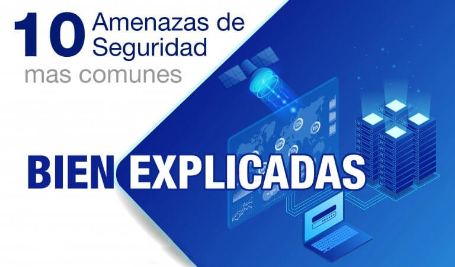

<center>
    
</center>

La `seguridad de la información`, que suele abreviarse como InfoSec, es un conjunto de medidas y técnicas utilizadas para controlar y salvaguardar todos los datos que se manejan dentro de una organización frente al uso indebido, acceso no autorizado, interrupción o destrucción, y asegurar que los datos no salgan del sistema que ha establecido la organización. Es una pieza clave para que las empresas puedan llevar a cabo sus operaciones, ya que los datos que maneja son esenciales para la actividad que desarrollan.

InfoSec comprende la seguridad física y del entorno, el control de acceso y la ciberseguridad. Suele incluir tecnologías como agente de seguridad de acceso a la nube (CASB), herramientas de engaño, detección y respuesta en el punto de conexión (EDR) y pruebas de seguridad para DevOps (DevSecOps), entre otras.

Es importante comprender que cualquier organización, independientemente de su tamaño, cuenta con datos confidenciales, (clientes, trabajadores, proveedores, socios, etc...), es decir, todos los datos que se procesan a diario en los sistemas de una empresa, y por ello tiene que establecer las medidas de seguridad en protección de datos necesarios para garantizar el correcto tratamiento de estos.

Fomentar la seguridad de la información es fundamental para evitar que personas no autorizadas tengan acceso a estos datos y, como consecuencia de este acto, se produzca toda una serie de inconvenientes.

## Objetivos

Si partimos del hecho de que la seguridad de la información puede cambiar en función de las características de cada organización y del sector al que dedique su actividad económica, podemos hablar de una serie de objetivos comunes que comparten todas las organizaciones del ámbito de la seguridad de la información y la protección de datos.

```text
El propósito de la seguridad de la información es blindar a la organización de ataques digitales
de ciberdelincuentes así como protegerla de fugas de datos y accidentes tecnológicos.
```

Encontramos estos objetivos de la seguridad de la información en la norma `ISO 27001`. La norma establece un modelo para la implementación de sistemas de gestión de seguridad de la información. El principal fin que persigue la norma ISO 27001 es la protección de los activos de información, es decir, equipos, usuarios e información.

Se establece este sistema ISO de seguridad de la información hay que tener en cuenta tres aspectos fundamentales:

* Integridad
* Confidencialidad
* Disponibilidad

<center>
    
</center>

### Integridad

Los sistemas que gestionan la información tendrán que garantizar la integridad de la misma, es decir, que la información se muestra tal y como fue concebida, sin alteraciones o manipulaciones que no hayan sido autorizadas de forma expresa.

El objetivo principal es garantizar la transmisión de los datos en un entorno seguro, utilizando protocolos seguros y técnicas para evitar posibles riesgos.

### Confidencialidad

La confidencialidad garantiza que solo las personas o entidades autorizadas tendrán acceso a la información y datos recopilados y que estos no se divulgarán sin el permiso de forma correspondiente. Los sistemas de seguridad de la información tendrán que garantizar que la confidencialidad de la misma no se ve comprometida en ningún momento.

### Disponibilidad

En este aspecto se garantiza la información que se encuentra disponible en todo momento para todas las personas o entidades autorizadas para su manejo y conocimiento. Para esto deberán existir medidas de soporte y seguridad que se puedan acceder a la información cuando resulte necesario y que evite que se establezcan interrupciones en los servicios.

Existen otros 2 aspectos aunque no fundamentales, pero si importantes en cualquier información que se maneja dentro y fuera de las organizaciones:

### Autenticidad

La autenticidad garantiza que los datos e información almacenados por la empresa sean legítimos, es decir, que no han sufrido modificación alguna por parte de terceros.

### Legalidad

Asegura que todas las acciones cuyo eje ha sido la seguridad de la información se han tomado y aplicado en base a la legislación vigente.

## Impotancia

Los sistemas de seguridad de la información deben ser capaces de gestionar el riesgo existente y superarlo con el menor impacto para la organización, es decir, tiene que ser capaces de garantizar la resiliencia de la organización y sus sistemas de seguridad con lo que prevenir, evitar y solucionar cualquier riesgo o ataque que se derive del tratamiento de la información y los datos.

Las organizaciones tienen que contar con soluciones tecnológicas adecuadas que no solo aseguren la protección, sino que también permitan conocer en todo momento el estado de dicha protección y que proporcionen las herramientas necesarias para garantizar la continuidad de las organizaciones y su actividad en caso de que sufran un ataque.

## Tipos de información

Hay 3 tipos de información con las que trabaja cualquier organización, independientemente de su actividad o sector, y que tienen que ser tomados en cuenta para realizar a cabo una protección de datos adecuada:

### Crítica

La información crítica es la que es indispensable para el correcto funcionamiento de la organización y sus operaciones, establece los beneficios de la organización a medio y largo plazo, ya que facilitará las ventas y el servicio al cliente.

Conocer la información y los datos son necesarios para establecer todos los protocolos de seguridad necesarios para su protección.

### Valiosa

Es la información para que la organización siga adelante. Tiene un alto componente subjetivo y lo que para una organización es información valiosa, para otra puede no serlo, ya que depende de la actividad y el sector.

No toda la información y datos tienen el mismo valor y las empresas deben analizar cuáles son necesarios y cuáles no para el funcionamiento de negocio.

### Sensible

La información es sensible en el sentido de que es información privada de los clientes de la organización y, por lo tanto, solo tiene que tener acceso a las mismas personas autorizadas. Los sistemas de seguridad de la información tienen que garantizar la protección de datos de los clientes.

## Política de Seguridad de la Información

<center>
    
</center>

La Política de Seguridad de la Información (PSI), es un documento que debe contener todas los lineamientos que deben seguirse para garantizar la protección de los datos y la información de una empresa.

La PSI debe describir todos los procedimientos a aplicar en la vida diaria de los profesionales para prevenir ataques o fuga de datos, así como también indicar qué tecnologías de seguridad hay que utilizar, cuáles serán las sanciones para quienes incumplan con las pautas, y cualquier otro lineamiento relacionado.

Esta normativa es tan importante que incluso algunos países tienen su propia Ley de Seguridad Informática.

### Las mejores tecnologías en seguridad de la información

Para saber, de hecho, qué es la seguridad de la información, es muy importante saber también qué tecnologías se utilizan para este fin.

Entre los recursos tecnológicos que se pueden utilizar para promover este tipo de seguridad de la información y su protección se encuentran:

* Cifrado de datos
* Almacenamiento en la nube
* Firma electrónica
* Implementación de firewalls
* Certificados SSL (Secure Sockets Layer o capa de conexión segura)
* Antispywares
* Antivírus
* Función Hash
* Conexiones seguras

La elección de la tecnología de seguridad de la información más adecuada debe ser compatible con el nivel de protección que la empresa necesita y pretende alcanzar, considerando su perfil y condiciones actuales.

### Errores más comunes

Aunque es extremadamente importante para todas las empresas, muchas aún cometen errores con respecto a la seguridad de la información. Los más recurrentes son:

* No invertir en tecnología para promover la seguridad de la información.
* No crear una política de seguridad.
* No trabajar con profesionales que tengan amplia experiencia en esta área.

### ¿Cómo garantizar la seguridad de la información?

Para garantizar la seguridad de la información de tu empresa, se recomienda:

* Mantener actualizado los softwares y drivers que se utilicen.
* Crear una política de seguridad de la información.
* Establecer controles de acceso.
* Bloquear conexiones salientes.
* Capacitar a los empleados.
* Utilizar buenas herramientas de monitoreo de datos.
* Proteger las redes wi-fi.
* Realizar una copia de seguridad de la información y los datos que circulan a diario.
* Usar almacenamiento en la nube.
* Establecer contratos de confidencialidad.
* Realizar una gestión de riesgos.
* Crea contraseñas seguras.
* Seguir las tendencias en este tema.
* Tener planes de contingencia.
* Contratar una empresa especializada en caso de no contar con personal interno para estas tareas.

### ¿Qué pasa cuando no hay seguridad de la información?

Si una empresa no se ocupa de un manejo seguro de la información, pueden haber diversas consecuencias. Por ejemplo, puede haber:

* Interrupción de servicios y procesos hasta que se resuelva el problema ocasionado, sea por una fuga de datos o un ataque.
* Pérdidas financieras relacionadas a fraudes bancarios, entre otras cuestiones relacionadas.
* Secuestro de datos.
* Robo de contraseña.
* Fuga de información confidencial.
* Pérdida de la confianza de tus clientes.
* Afectación de la imagen de la empresa, que puede verse muy comprometida.

### Elementos clave

* `Seguridad de aplicaciones`. Políticas, procedimientos, herramientas y procedimientos recomendados que se aplican para proteger las aplicaciones y sus datos.
* `Seguridad en la nube`. Políticas, procedimientos, herramientas y procedimientos recomendados que se aplican para proteger todos los aspectos de la nube, incluidos sistemas, datos, aplicaciones e infraestructura.
* `Criptografía`. Método basado en algoritmos para proteger la comunicación para garantizar que solo los destinatarios de un mensaje específico pueden verlo y descifrarlo.
* `Recuperación ante desastres`. Método para restablecer los sistemas tecnológicos funcionales tras un evento disruptivo como, por ejemplo, un desastre natural o un ciberataque.
* `Respuesta a incidentes`. El plan de respuesta de la organización para corregir y administrar las consecuencias de un ciberataque, una vulneración de datos u otro evento disruptivo.
* `Seguridad de infraestructura`. La seguridad que comprende toda la infraestructura tecnológica de una organización, incluyendo tanto los sistemas de hardware como de software.
* `Administración de vulnerabilidades`. El proceso que lleva a cabo una organización para identificar, evaluar y corregir vulnerabilidades en sus puntos de conexión, software y sistemas.

## Amenazas de seguridad de la información comunes

<center>
    
</center>

* `Ataque de amenaza persistente avanzada (APT)`: Un ciberataque sofisticado que se da durante un período prolongado de tiempo durante el que un atacante (o grupo de atacantes) no detectado obtiene acceso a la red y datos de la empresa.
* `Red de robots (botnet)`: Derivado del término "robot network", una botnet conforma una red de dispositivos conectados el cual un atacante infecta con código malicioso y los controla de forma remota.
* `Ataques de denegación de servicio distribuidos (DDoS)`: Los ataques DDoS usan redes de robots (botnets) para sobrecargar el sitio web o aplicación de una organización, lo que resulta en un bloqueo o denegación de servicio a los usuarios o visitantes válidos.
* `Ataque de descarga oculta`: Un fragmento de código malicioso que se descarga automáticamente en el dispositivo de un usuario tras visitar una página web y que hace que el usuario sea vulnerable a otras amenazas de seguridad.
* `Kit de vulnerabilidad de seguridad`: Un conjunto integral de herramientas que usan vulnerabilidades de seguridad para detectar otras que les permitan infectar dispositivos con malware.
* `Amenaza interna`: Existe la posibilidad de que alguien (empleado) interno a la organización aproveche (consciente o inconscientemente) el acceso autorizado para dañar o hacer vulnerables los sistemas, redes y datos de la organización.
* `Ataque tipo Man-in-the-middle (MitM)`: Un atacante malicioso interrumpe una línea de comunicación o transferencia de datos haciéndose pasar por un usuario válido para robar información o datos.
* `Ataque de phishing`: Los ataques de phishing se hacen pasar por organizaciones o usuarios legítimos para robar información por correo, mensaje de texto u otros métodos de comunicación.
* `Ransomware`: Un ataque de extorsión por malware que cifra la información de una organización o persona impidiendo el acceso hasta que se pague un rescate (Bitcoin o Monero).
* `Ingeniería social`: Ciberataques que tienen su origen en interacciones humanas. El atacante se gana la confianza de la víctima a través de un señuelo, scareware o phishing, recoge información personal y la usa para llevar a cabo un ataque.
* `Ataque en redes sociales`: Ciberataques que tienen como objetivo plataformas de redes sociales, aprovechándolas como mecanismo de entrega o para robar información y datos de los usuarios.
* `Virus y gusanos`: Malware malicioso indetectable que puede replicarse a sí mismo a lo largo de la red o sistema de un usuario.

## Tecnologías utilizadas para la seguridad de la información

### Agentes de seguridad de acceso a la nube (CASB)

Puntos de cumplimiento de la política de seguridad que se posicionan entre usuarios de la empresa y proveedores del servicio en la nube que combinan varias políticas de seguridad diferentes, desde la autenticación y asignación de credenciales al cifrado, detección de malware y más. Los CASB tienen su función en aplicaciones autorizadas y no autorizadas y dispositivos administrados y no administrados.

### Prevención de pérdida de datos

La prevención de pérdida de datos (DLP) comprende las políticas, procedimientos, herramientas y procedimientos recomendados que se aplican para evitar la pérdida o uso indebido de datos confidenciales. Las herramientas clave incluyen el cifrado o transformación de texto sin formato en texto cifrado a través de un algoritmo y la tokenización o asignación de un conjunto de números aleatorios a los datos y el uso de una base de datos de tokens para almacenar la relación.

### Detección y respuesta de puntos de conexión (EDR)

La EDR es una solución de seguridad que emplea un conjunto de herramientas para detectar e investigar las amenazas y responder a ellas en dispositivos de punto de conexión.

### Microsegmentación

La microsegmentación divide los centros de datos en zonas múltiples, granulares, seguras o segmentos que mitigan los niveles de riesgo.

### Pruebas de seguridad para DevOps (DevSecOps)

DevSecOps es el proceso de integración de medidas de seguridad en cada paso del proceso de desarrollo, de forma que se aumenta la velocidad y se mejora la oferta de procesos de seguridad más proactivos.

### Análisis de comportamiento de usuario y entidad (UEBA)

UEBA es el proceso de observación del comportamiento típico de un usuario para detectar acciones que se salen de lo normal. Esto ayuda a las empresas a identificar amenazas potenciales.

## Tipos de seguridad de datos

### Cifrado

Al utilizar un algoritmo para transformar caracteres de texto normales en un formato ilegible, las claves de cifrado codifican los datos para que solo los usuarios autorizados puedan leerlos.

Las soluciones de cifrado de archivos y bases de datos  sirven como una última línea de defensa para volúmenes de datos confidenciales al ocultar su contenido mediante cifrado o tokenización. La mayoría de las soluciones también incluyen funcionalidades de gestión de claves de seguridad.

### Eliminación de datos

Más seguro que el borrado de datos estándar, la eliminación de datos utiliza software para sobrescribir completamente los datos en cualquier dispositivo de almacenamiento. Asegura que los datos sean irrecuperables.

### Enmascaramiento de datos

Al enmascarar los datos, las organizaciones pueden permitir que los equipos desarrollen aplicaciones o capaciten a las personas con el uso de datos reales. Enmascara la información de identificación personal (PII) cuando sea necesario para que el desarrollo pueda ocurrir en entornos que mantienen la conformidad.

### Resiliencia de datos

La resiliencia está determinada por qué tan bien una organización aguanta o se recupera de cualquier tipo de falla, desde problemas de hardware hasta cortes de energía y otros eventos que afectan la disponibilidad de los datos. La velocidad de recuperación es fundamental para minimizar el impacto.

## Recursos y soluciones de seguridad de datos

Las herramientas y tecnologías de seguridad de datos deben abordar los crecientes desafíos inherentes a la seguridad de los entornos informáticos complejos, distribuidos, híbridos y/o multinube de hoy.Estos incluyen comprender dónde residen los datos, realizar un seguimiento de quién tiene acceso a ellos y bloquear actividades de alto riesgo y movimientos de archivos potencialmente peligrosos.

Las soluciones integrales de protección de datos que permiten a las empresas adoptar un enfoque centralizado para la supervisión y aplicación de políticas pueden simplificar el trabajo.

### Descubrimiento y clasificación de datos

La información confidencial puede residir en repositorios de datos estructurados y no estructurados, incluidas bases de datos, almacenes de datos, plataformas de big data y entornos de nube. Las soluciones de clasificación y descubrimiento de datos automatizan el proceso de identificación de información confidencial, así como la evaluación y reparación de vulnerabilidades.

### Supervisión de actividad de datos y archivos

Las herramientas de supervisión de actividad de archivos analizan los patrones de uso de datos, lo que permite a los equipos de seguridad ver quién está accediendo a los datos, detectar anomalías e identificar riesgos. También se pueden implementar alertas y bloqueos dinámicos para patrones de actividad anormales.

### Herramientas de evaluación de vulnerabilidades y análisis de riesgos

Estas soluciones facilitan el proceso de detección y mitigación de vulnerabilidades, como software desactualizado, configuraciones incorrectas o contraseñas débiles, y también pueden identificar fuentes de datos con mayor riesgo de exposición.

### Informes de cumplimiento automatizados

Las soluciones integrales de protección de datos con funciones automatizadas de generación de informes proporcionan un repositorio centralizado para las pistas de auditoría de conformidad de toda la empresa.

## Estrategias de seguridad de datos

Una estrategia integral de seguridad de datos involucra personas, procesos y tecnologías.

Establecer controles y políticas adecuados es tanto una cuestión de cultura organizacional como de la implementación del conjunto adecuado de herramientas. Esto significa que la seguridad de la información deber ser la prioridad en todas las áreas de la empresa.

### Seguridad física de servidores y dispositivos de usuario

Independientemente de si sus datos se almacenan en las instalaciones, en un centro de datos corporativo o en la nube pública, debe asegurarse de que las instalaciones estén protegidas contra intrusos y que cuenten con medidas adecuadas de extinción de incendios y controles climáticos. Un proveedor de nube asumirá la responsabilidad de estas medidas de protección por usted.

### Controles y gestión de acceso

El principio de "acceso con privilegios mínimos" debe seguirse en todo el entorno de TI. Esto significa otorgar acceso a la base de datos, la red y la cuenta administrativa a la menor cantidad de personas posible, y solo a aquellos que realmente lo necesitan para realizar su trabajo.

### Aplicación de seguridad y parches

Todo el software debe actualizarse a la última versión tan pronto como sea posible después de que se publiquen parches o nuevas versiones.

### Copias de seguridad

El mantenimiento de copias de seguridad utilizables y probadas minuciosamente de todos los datos críticos es un componente central de cualquier estrategia sólida de seguridad de datos. Además, todas las copias de seguridad deben estar sujetas a los mismos controles de seguridad físicos y lógicos que rigen el acceso a las bases de datos primarias y los sistemas centrales.

Descubra más acerca de la copia de seguridad y recuperación de datos

### Capacitación de empleados

Capacitar a los empleados sobre la importancia de las buenas prácticas de seguridad y la higiene de las contraseñas y enseñarles a reconocer los ataques de ingeniería social los transforma en un "firewall humano" que puede desempeñar un papel fundamental en la protección de sus datos.

### Supervisión y controles de seguridad de redes y puntos finales

La implementación de un conjunto completo de herramientas y plataformas de gestión, detección y respuesta de amenazas en su entorno local y plataformas en la nube puede mitigar los riesgos y reducir la probabilidad de una brecha.

##  Tendencias de seguridad de datos

### IA

La IA amplifica la capacidad de un sistema de seguridad de datos, porque puede procesar grandes volúmenes de datos. La Computación Cognitiva, un subconjunto de la IA, realiza las mismas tareas que otros sistemas de IA, pero lo hace simulando los procesos de pensamiento humano.

En la seguridad de datos, esto permite una rápida toma de decisiones en momentos de necesidad crítica.

### Seguridad multinube

La definición de seguridad de datos se ha ampliado a medida que crecen las funcionalidades de la nube. Ahora las organizaciones necesitan soluciones más complejas, ya que buscan protección no solo para los datos, sino también para las aplicaciones y los procesos comerciales patentados que se ejecutan en nubes públicas y privadas.

### Tecnología cuántica

La tecnología cuántica, una tecnología revolucionaria, promete dar un vuelco exponencial a muchas tecnologías tradicionales. Los algoritmos de cifrado serán más multifacéticos, más complejos y más seguros.

# Siguiente Nivel

En esta sección iremos a diferentes sitios donde se explicará de forma más detallada cada uno de los temas:

* [ISO 27001](https://iso27001.4rlekiing.net/)
