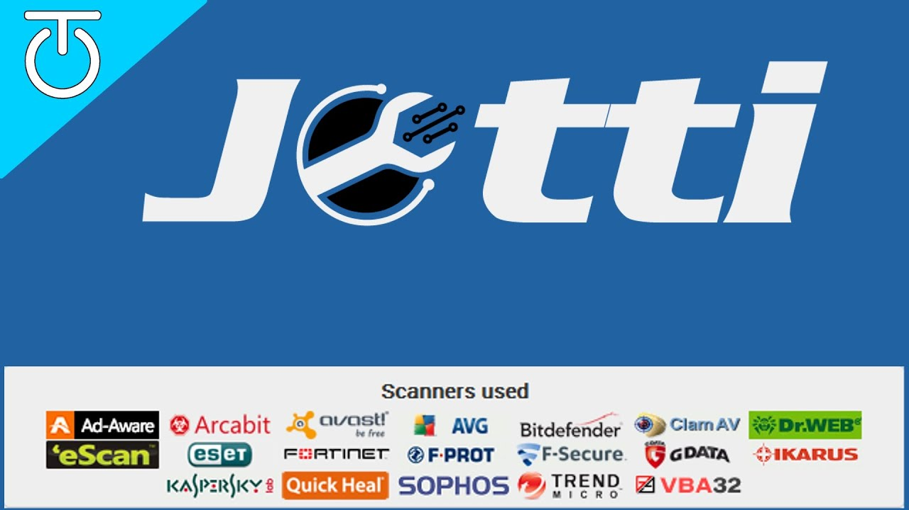
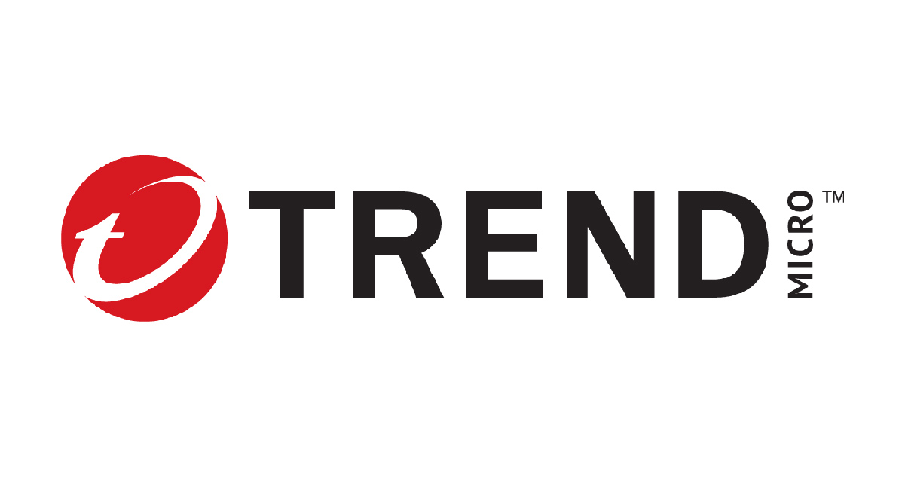
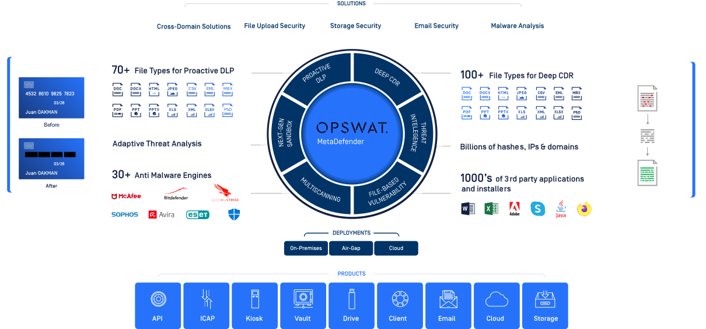

## Análisis de archivos y URL

Las herramientas que aquí se mencionan son funcionales a la hora de analizar un archivo y/o página web, pero encarecidamente les advierto que esto no reemplaza a ningún antivirus; muchos malware solo necesitan ser descargador en un ordenador para poder infectar, de nada servirá que descargues el archivo y despues lo analices si ya fuiste infectado.

Otra recomendación muy importante, nunca suban archivos con información personal, sensible u otro tipo de información que tenga cierto grado de sensibilidad, ya que estos sitios de analisis de malware, comparten los archivos o los hashes con los motores de malware, en pocas palabras, estás compartiendo tu información con las empresas de antivirus.

Cuando descargamos algún archivo desde internet nuestra mejor herramienta para verificar que esté libre de malware es [Virustotal](https://www.virustotal.com/gui/home/upload); en esta página puedes cargar el archivo y lo analizará en cuestión de minutos o segundos, esta página cuenta con motores de búsqueda de malware de diferentes proveedores de antivirus.

Además de analizar archivos, también puede analizar URL, es decir si creemos que la página no es segura, solo necesitamos copiar el link de la página que vamos a ingresar y la pegamos en este portal, automáticamente la analizará y nos dirá si esconde algo.

### Cómo usarlo

Si desea verificar un archivo, debe subirlo al servicio presionando el botón "Elegir archivo" y localizándolo. Recuerde que el tamaño máximo de carga es de 650 MB, y el tiempo de carga depende en gran medida de su conexión a Internet. Es posible que deba ser un poco paciente de vez en cuando.

Aparte de VirusTotal, también tenemos otras opciones, por ejemplo [urlvoid](https://www.urlvoid.com/), en este sitio podemos analizar las direcciones URL que necesitemos, además nos brindan una serie de herramientas el cual podemos utilizar para "escanear" de cierta manera un dominio (WHOIS, DNS, PING, SCREENSHOT, PASSWORD (Genera una contraseña robusta), SORT, DNSSEC, BASE64, Entre muchas más ...).

Una herramienta más es [virscan](https://www.virscan.org/) es una herramienta online para escanear archivos en busca de virus y otras amenazas informáticas. Opera con decenas de motores de antivirus para detectar rápidamente malwares, spywares, ransomwares, adwares, etc.

Su función es escanear archivos y documentos para comprobar que están limpios, así como hashes (SHA256, MD5, SHA1). VirSCAN opera con los motores de los principales antivirus del mercado, como son Avast, AVG, Bitdefender, Kaspersky, Panda, entre otros. Por esa razón, VirSCAN no asume la responsabilidad sobre los resultados del escaneo.

El formato no está limitado y puede cargar archivos con un tamaño inferior a 100 MB para su detección. Al enviar una muestra, usted acepta nuestros Términos de servicio y Política de privacidad.

[Jotti's malware scan](https://virusscan.jotti.org/es-ES) es un servicio gratuito que le permite analizar archivos sospechosos con varios programas antivirus. Usted puede subir hasta 5 archivos al mismo tiempo. Hay un límite de 250MB por archivo. Por favor tenga presente que ninguna solución de seguridad ofrece un 100% de protección, ni siquiera cuando esta usa varios motores antivirus. Todos los archivos son compartidos con la compañías de detección de antivirus para que la exactitud de detección de sus productos pueda ser mejorada.

[Trend Micro](https://www.trendmicro.com/en_us/forHome.html) es una firma en ciberseguridad para nubes y empresas, cuenta con técnicas avanzadas de defensa contra amenazas optimizadas para ambientes como AWS, Microsoft y Google.

Tiene su antivirus, pero también cuenta con algunas herramientas gartuitas y que son importantes a la hora de buscar información, por ejemplo: [Escaneo en línea](https://experience.trendmicro.com/?utm_source=onlinescan&utm_medium=menu&&utm_campaign=experience) y [Herramientas Gratuitas](https://www.trendmicro.com/en_us/forHome/products/free-tools.html).

[MetaDefender Cloud](https://metadefender.opswat.com/), una plataforma con funciones muy similares: nos permite remitir archivos (de hasta 140 Mb) y URLs a través de su web, para que sean sometidos a análisis por parte de 40 motores antivirus distintos. Su porcentaje de detección es claramente menor que el de la herramienta de Google, eso sí.

Carece de una opción que nos permita enviar archivos por correo, y tampoco ofrece extensiones para el navegador, pero a cambio nos facilita acceso a su API para mostrar en nuestras aplicaciones información de las consultas sobre los archivos.

[Kaspersky VirusDesk](https://opentip.kaspersky.com/), al contrario que el resto de herramientas de esta lista, no nos ofrece acceso a múltiples motores antivirus: le basta con usar el motor del antivirus de escritorio homónimo, uno de los más reputados del sector.

Como los anteriores, la herramienta web nos dará la opción de subir el archivo directamente, o bien de pegar una URL en el formulario.

Aunque no lo recomiendo utilizarlo de base, me interesó la parte de información que tienen sobre los analisis que han hecho de malware, y te brindan información acerca de ellos.

## URL acortadas

    

Existen varios proveedores de servicios en internet que lo que hacen es acortar una URL extensa [bitly](https://bitly.com/), por ejemplo, para evitar escribir *"https://4rleking.github.io/"* lo acortan haciendo *"https://bit.ly/45u7dxs"* que es mucho más fácil de escribir o de "pasar desapercibido", para hacerlo un poco más amigable pueden crear un código QR.

Muchas de las empresas de marketing, y no solo de este ramo utilizan este tipo de servicios de acortadores de URL, por lo regular lo utilizan para detectar de donde tienen más visitantes, ya que estos servicios de acortadores al registrar un nuevo link, automáticamente le designan un contador de "visitas" a ese link.

Así como puede ser beneficioso para unas cosas, puede ser utilizado para robarte información o en su defecto infectarte con malware, por ejemplo, un sitio "clon" (phishing) de algún banco, tienda departamental, tienda online, el típico "te ganaste un IPhone" si llenas el siguiente formulario y lo compartes con tus amigos; muchas de las veces son sitios como "https:/promociones5000.com" y con este dominio nadie o muy poca gente caería en sus estafas, es por esto que utilizan el acortador, para disfrazar la URL y así garantizar o tratar de garantizar que más personas caigan en sus estafas.

Para evitar esto, existe un servicio online gratuito [ExpandURL](https://www.expandurl.net/), el cual copias la URL acortada y la pegas en este sitio, automáticamente seguirá la ruta de esta URL acortada (sin entrar a ese sitio) y te dirá cuál es el sitio final; y ahora sí ya depende del usuario final si entra o no al sitio.

## Comprobar la seguridad de una contraseña
